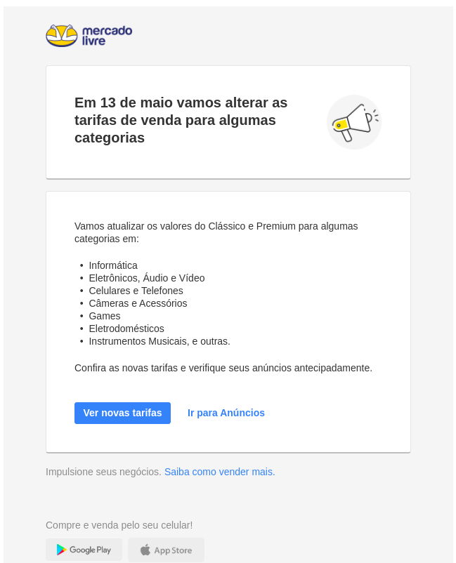
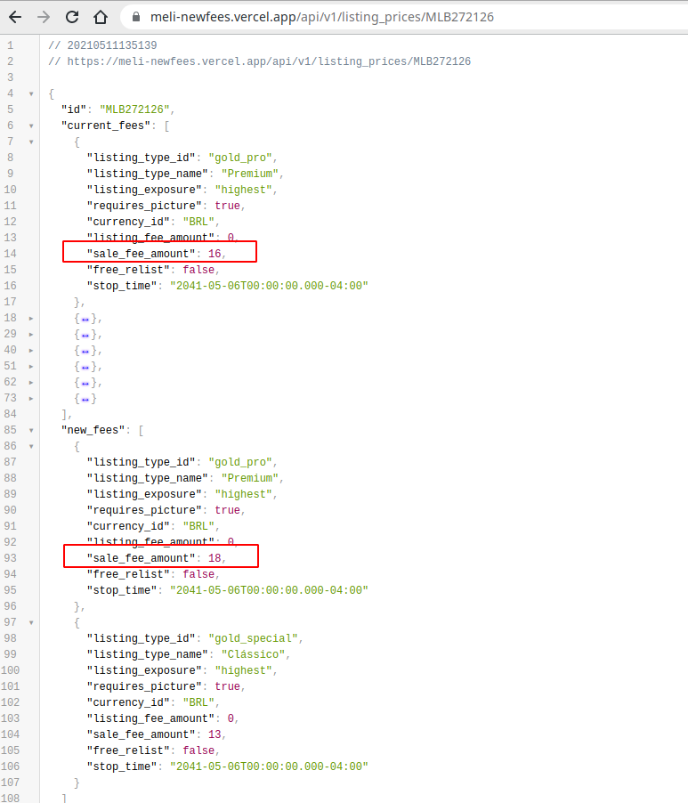

# Meli new fees

Non official API for get new fees announced on 29/04/2021 by Mercado Livre



## Using


```sh
curl -X GET https://meli-newfees.vercel.app/api/v1/listing_prices/MLB272126
```

- Change MLB272126 for category ID



## How this work?

- Mercado Livre show the new fees in this link: https://www.mercadolivre.com.br/landing/costos-venta-producto?domain=2904
This page get fees from a large json, this json is the file `./files/new_fees.json` the project.
- `current_fees` field is current fees from Mercado Livre API from endpoint: `https://api.mercadolibre.com/sites/MLB/listing_prices?price=100&category_id=<CATEGORY_ID>`
- `new_fees` this field is from file `./files/new_fees.json`
- `old_fees` this field is from file `./files/old_fees.json`, is fees before 13/05/2021

## Contributing / Problems?

If you have encountered any problem, difficulty or bug, please start by opening a issue.

Bug reports and pull requests are welcome on GitHub at https://github.com/douglara/meli-newfees . This project is intended to be a safe, welcoming space for collaboration.

## License

The gem is available as open source under the terms of the [MIT License](https://opensource.org/licenses/MIT).
